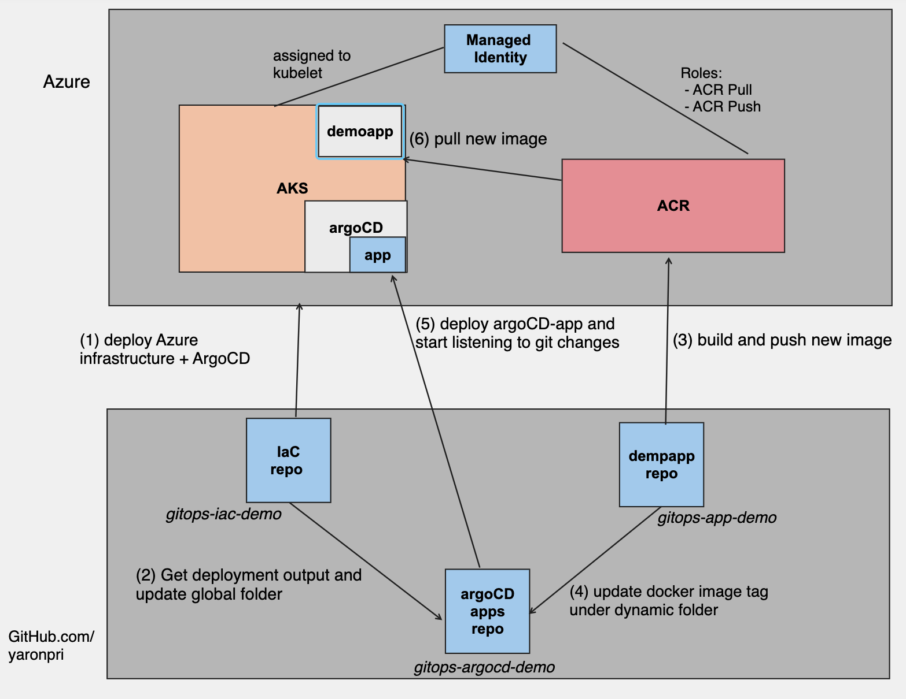

# gitops-iac-demo

## About
This repo is part of three GitOps CI/CD demo repos:
- [IaC repo](https://github.com/yaronpri/gitops-iac-demo)
- [App repo](https://github.com/yaronpri/gitops-app-demo)
- [ArgoCD repo](https://github.com/yaronpri/gitops-argocd-demo)

This IaC repo contains Bicep files for deploying Azure Services (AKS, ACR and Managed Identity) and installing ArgoCD over AKS using GitHub Action.

It's important to understand the role of Managed Identity which enable us the option to Pull Images from the ACR without the need to store any passwords anywhere (read more [here](https://learn.microsoft.com/en-us/azure/aks/use-managed-identity)).

Once  deployment completed, the outputs: resource-group, AKS names committed to a files under Global folder and ACR name committed to a file under dynamic folder under the related Helm chart folder in ArgoCD repo.

As part of the GitHub Actions, we are executing IaC code scanning using [Checkov](https://www.checkov.io/) to make sure our IaC code compliance with our security standards.

## GitOps Architecture 

## How to configure this repo
- Fork this repo
- Establish a trust between GitHub.com and your Azure subscription by configuring OpenID connect, follow [this](https://docs.github.com/en/actions/deployment/security-hardening-your-deployments/configuring-openid-connect-in-azure) article.
- Create a PAT in your GitHub account, follow this article (we will refer [this](https://docs.github.com/en/authentication/keeping-your-account-and-data-secure/creating-a-personal-access-token) value as ACTIONS_TOKEN).
- Generate a public SSH key to be used for AKS deployment (we will refer this value as PUBLIC_KEY).
- Add the following GitHub Action secrets: AZURE_CLIENT_ID, AZURE_SUBSCRIPTION_ID, AZURE_TENANT_ID (the values should taken after following OpenID connect article), ACTIONS_TOKEN and PUBLIC_KEY.
